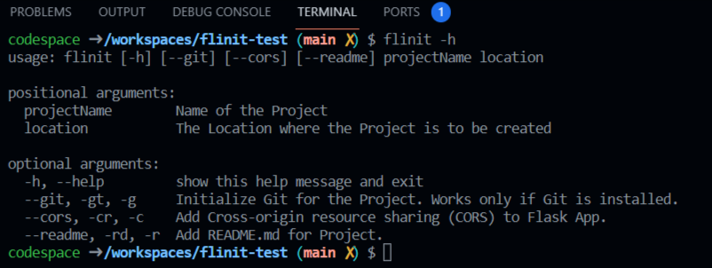
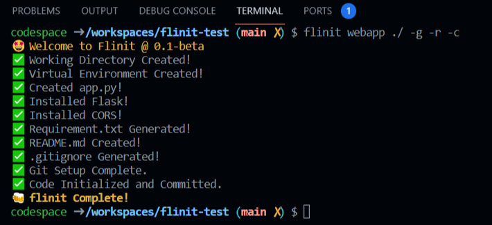
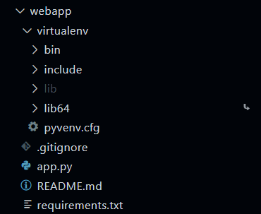

# flinit <kbd>0.1-beta</kbd>

Flinit ( **fl**ask **init** ) is a  Python Command-Line Tool to Initialize a Python-Flask Project with Boilerplate Code and other required tools.

Flinit is a create-react-app like tool for Flask Projects.

## Features
- Creates Project Working Directory
- Spins up a Python Virtual Environment
- Generates Flask App File, <kbd>app.py</kbd>
- Installs Flask and CORS (optional)
- Adds Flask and CORS Helper Methods
- Adds Boilerplate Code to <kbd>app.py</kbd>
- Generates initial environment requirments file
- Adds <kbd>README.md</kbd> to the project
- Generates <kbd>.gitignore</kbd> for Python Project
- Initializes Git for Project.


# Usage

Flinit can be used on any system with Python and PIP installed and **PIP added to the OS Environment Path**.

## Installation

Flinit can be installed using Pip.

```
pip install flinit
```

## Using Flinit to Create a Flask Project

After installing flinit using pip, goto any CLI and use the <kbd>flinit</kbd> command to setup the Flask App.

```
flinit [projectName] [location] -g -r -c

flinit [projectName] [location] -gt -rd -cr

flinit [projectName] [location] --git --readme --cors
```

<kbd>projectName</kbd> - The Name of the Project.

<kbd>location</kbd>    - Path where Project is to be setup.

**Flags**

<kbd>-h</kbd> or <kbd>--help</kbd> - Provides Instruction about how to use Flinit.

<kbd>-g</kbd> or <kbd>-gt</kbd> or <kbd>--git</kbd> - Flag to add git to project. If this flag is used, git will be initialized for the project.

<kbd>-r</kbd> or <kbd>-rd</kbd> or <kbd>--readme</kbd> - Flag to add README.md to project. If this flag is used, a README file is generated.

<kbd>-c</kbd> or <kbd>-cr</kbd> or <kbd>--cors</kbd> - Flag to install and CORS to project. If this flag is used, CORS is installed and added a helper method is added to the app.py file.


# <kbd>flinit</kbd> in Action

**Flinit Helper**



**Creating a Flask App <kbd>webapp</kbd>**



**Flask App webapp, initialized using <kbd>flinit</kbd>**




[//]: https://stackabuse.com/executing-shell-commands-with-python/

[//]: https://stackoverflow.com/questions/1158076/implement-touch-using-python

[//]: https://youtu.be/BKvj4FH67H8?t=1296

[//]: https://dev.to/divshekhar/python-subprocess-execute-shell-commands-1bl2#:~:text=The%20subprocess.,object%20of%20CompletedProcess%20in%20Python.

[//]: https://code-maven.com/slides/python/argparse-named

[//]: https://stackoverflow.com/questions/53151899/python-how-to-script-virtual-environment-building-and-activation